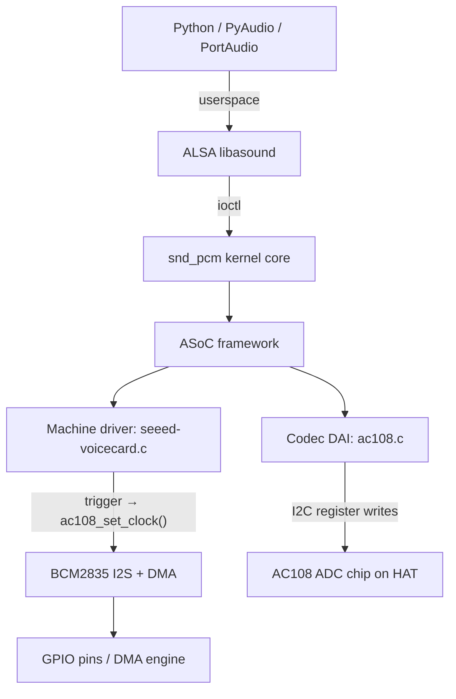

# Investigation Handoff — Driver-Level Crash Analysis

*2026-04-03 — How the investigation reached the driver, and what was known at the start of detailed analysis*

This document preserves the historical context of how the crash investigation evolved from a USB misdiagnosis to the I2S/AC108 driver teardown root cause. It is superseded by [`ac108_shutdown_crash_analysis.md`](ac108_shutdown_crash_analysis.md) for all technical detail, but retains value as the narrative of how the investigation was structured.

---

## The I2S Revelation

The ReSpeaker 4-Mic Array HAT connects via the Pi's GPIO header using **I2S** (Inter-IC Sound), not USB. The audio path is:

**There is no USB anywhere in this path.** The entire Root Cause 5 analysis in `shutdown_and_buffer_patterns.md` (xHCI faults, USB isochronous transfers, URB cancellation races) was built on a false premise. Every Python mitigation targeting USB (paComplete, skip Pa_CloseStream, os._exit to avoid Pa_Terminate) has been addressing the wrong mechanism.

## Why the crash persists despite os._exit(0)

`os._exit(0)` bypasses Python destructors but NOT kernel cleanup. When the child process exits, the kernel closes all open file descriptors — including the ALSA PCM device FD. This triggers the kernel's `snd_pcm_release()` path, which calls into the seeed-voicecard and ac108 driver code. **There is no way to avoid the driver's teardown path from Python.** The crash must be fixed in the driver.

---

## Investigation workstreams

The investigation was structured into three sequential workstreams. This section records the original plan for historical context; outcomes are noted inline.

### Workstream 1: Fork Decision

*Outcome: resolved. A fork branch (`ac108-shutdown-fix` on `TSheahan/seeed-voicecard`) was created from `HinTak/seeed-voicecard` branch `v6.12`. DKMS-based installation is in use on the Pi.*

### Workstream 2: Deep Interface Analysis

A dedicated analysis round — agent reads all relevant source, produces a structured findings document — before any driver coding begins. This was explicitly to avoid the pattern of building a fix chain on a misdiagnosed premise.

**Scope covered:**

- **Layer 1 — AC108 register operations:** Full audit of `ac108_aif_shutdown`, `ac108_trigger`, `ac108_set_clock`, `ac108_hw_params`. Regmap configuration confirmed as `REGCACHE_FLAT` with standard I2C bus ops (real I2C writes, not cache-only).
- **Layer 2 — seeed-voicecard machine driver:** `seeed_voice_card_trigger` (the `in_irq()` branch and workqueue race), `work_cb_codec_clk` (deferred clock-stop), `seeed_voice_card_shutdown` (no workqueue drain).
- **Layer 3 — ASoC / ALSA PCM kernel path:** Exact call sequence from process-exit FD close through `snd_pcm_release()` to `ac108_aif_shutdown`. TRIGGER_STOP ordering relative to shutdown callbacks.
- **Layer 4 — PortAudio / PyAudio boundary:** `paComplete` callback return, PortAudio's internal drain path, PCM state at FD close time.

*Outcome: completed. The full analysis is in [`ac108_shutdown_crash_analysis.md`](ac108_shutdown_crash_analysis.md). Four sleeping-in-atomic bugs identified, six fixes recommended.*

### Workstream 3: Memory Sweep

Sweep of raspberry-ai memory files for I2S/USB misalignment and other stale findings. This workstream belongs to the `raspberry-ai` project and is tracked there.

*Outcome: pending, tracked in raspberry-ai.*

---

## Suspicious patterns (pre-analysis, now confirmed)

These patterns were identified before detailed analysis began. All have since been confirmed or refined by the Workstream 2 analysis. They are preserved here as a historical record of the investigation's starting point.

1. **I2C inside spinlock** (`ac108.c:1068–1074`): `ac108_trigger` TRIGGER_START calls `ac10x_read()` and `ac108_multi_update_bits()` inside `spin_lock_irqsave`. **Confirmed:** `ac10x_read` is cache-only (safe), but `ac108_multi_update_bits` is a real I2C write (sleeping in atomic context). See Bug 4 in the analysis document.

2. **Workqueue race on TRIGGER_STOP** (`seeed-voicecard.c:249–253`): TRIGGER_STOP defers clock disable to a workqueue if called from interrupt context. **Confirmed:** race is structurally present but not on the primary crash path (the `in_irq()` check causes the synchronous path to be taken from process context). See Q4 in the analysis document.

3. **No error handling in shutdown** (`ac108.c:1115–1120`): `ac108_aif_shutdown` writes `MOD_CLK_EN=0` and `MOD_RST_CTRL=0` without checking return values. **Confirmed:** errors are silently discarded throughout the chain. See Q5 in the analysis document.

4. **Author's own admission** (`seeed-voicecard.c:231`): `/* I know it will degrades performance, but I have no choice */` — the spinlock was added as a concurrency band-aid. **Confirmed:** the guarded `#if CONFIG_AC10X_TRIG_LOCK` block is compiled out, but the sleeping operations outside the guard execute unconditionally. See Finding A in the analysis document.

---

## Key files

| File | Role |
|---|---|
| `ac108.c` | AC108 codec driver — primary crash suspect (sleeping-in-atomic in trigger, error-silent shutdown) |
| `seeed-voicecard.c` | Machine driver — trigger dispatch, workqueue race, `in_irq()` check |
| `ac10x.h` | Shared struct/header — `CONFIG_AC10X_TRIG_LOCK`, regmap declarations |
| `ac101.c` | Secondary codec — AC101, role in teardown path uncertain (U3) |
| `ac108_plugin/pcm_ac108.c` | Userspace ALSA plugin for channel mapping |

---

*Extracted from the investigation session plan on 2026-04-03. The technical analysis has moved to [`ac108_shutdown_crash_analysis.md`](ac108_shutdown_crash_analysis.md); this document preserves investigation structure and historical context only.*
