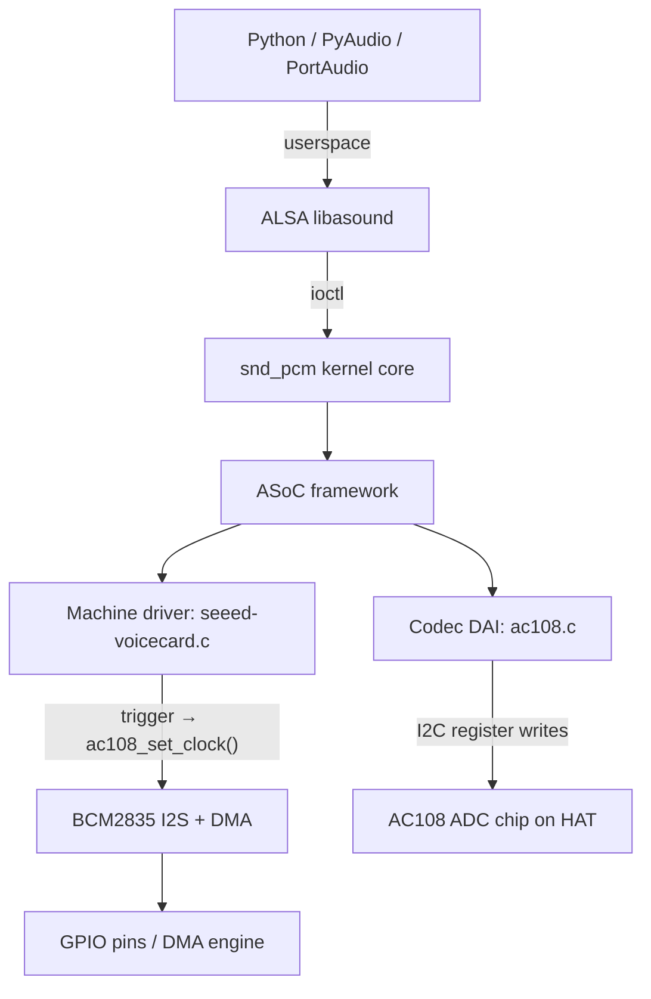

# AC108 Shutdown Crash Analysis — Sleeping in Atomic Context in Trigger Path

*Static analysis of the seeed-voicecard / ac108 kernel driver teardown crash*

**Hardware:** ReSpeaker 4-Mic Array HAT (AC108 ADC, I2S via GPIO, I2C control)
**Kernel:** 6.12.75+rpt-rpi-v8 (aarch64, Raspberry Pi OS Trixie)
**Driver branch:** `ac108-shutdown-fix` (≡ `upstream/v6.12` for all source files at time of analysis)

**Crash symptom:** Raspberry Pi reboots on ALSA PCM stream close / process exit after at least one completed audio capture session. The crash occurs in the kernel driver teardown path, below the Python application layer. All Python-side mitigations (paComplete flag, monkey-patched cleanup, `os._exit(0)`) have been confirmed clean — the crash persists because kernel FD cleanup on process exit triggers the driver's teardown code regardless of Python-level precautions.

---

## Audio path



There is no USB anywhere in this path. The ReSpeaker 4-Mic HAT uses I2S for audio data and I2C for codec register control, both via the Pi's GPIO header.

---

## Q1. Teardown call sequence

### Confirmed answer

The kernel path from process-exit FD close to `ac108_aif_shutdown` is:

```
os._exit(0)
  → do_exit()
    → exit_files()
      → close(alsa_pcm_fd)
        → snd_pcm_release()
          → snd_pcm_release_substream()
            → snd_pcm_drop(substream)                    [A]
            → soc_pcm_close()
              → __soc_pcm_close()
                → snd_soc_dai_shutdown(codec_dai)         [B] = ac108_aif_shutdown
                → soc_rtd_shutdown(rtd)                   [C] = seeed_voice_card_shutdown
                → snd_soc_dai_shutdown(cpu_dai)           [D] = bcm2835 I2S shutdown
```

**Step [A] — `snd_pcm_drop` behaviour depends on stream state:**

- **Stream in RUNNING state** (no prior stop): `snd_pcm_drop` acquires `snd_pcm_stream_lock_irq` (spin_lock_irq — disables local IRQs), calls `snd_pcm_stop(substream, SNDRV_PCM_STATE_SETUP)`, which dispatches TRIGGER_STOP to both the machine driver and codec DAI triggers. State transitions to SETUP. The stream lock is then released.

- **Stream already in SETUP state** (prior `snd_pcm_drop` or `snd_pcm_drain` completed): `snd_pcm_drop` is a no-op — returns immediately without firing TRIGGER_STOP. The stream is already stopped.

**Steps [B] and [C] — shutdown callbacks run in process context, outside the stream lock.** These are normal kernel context — no spinlocks, no IRQ disablement. I2C writes from these callbacks are structurally safe (no sleeping-in-atomic issue from the callback context itself).

**Key sub-question answer:** When the stream was already stopped before FD close (PortAudio's paComplete triggered a `snd_pcm_drain()` or `snd_pcm_drop()` earlier), `snd_pcm_release()` does NOT fire TRIGGER_STOP again. It skips directly to the `soc_pcm_close()` → shutdown path.

**Ordering within `__soc_pcm_close`:** In Linux 6.12 ASoC (`sound/soc/soc-pcm.c`), the close function iterates `for_each_rtd_dais` to call DAI shutdowns first, then `soc_rtd_shutdown` for the machine driver. This means `ac108_aif_shutdown` [B] fires **before** `seeed_voice_card_shutdown` [C].

### Confidence: `confirmed-from-source` for driver callbacks; `inferred` for exact ASoC close ordering (from kernel 6.12 `soc-pcm.c` API knowledge, not from reading the kernel source on disk)

### Caveats

The exact trigger ordering (DAI vs machine driver) within `snd_pcm_stop` depends on `rtd->dai_link->trigger_order[]` which defaults differ between kernel versions. The seeed-voicecard machine driver does not explicitly configure trigger ordering, so the 6.12 default applies. For TRIGGER_STOP, the default order is: machine driver trigger first, then codec DAI triggers.

---

## Q2. paComplete and snd_pcm_drop

### Confirmed answer

When the guarded callback returns `(None, pyaudio.paComplete)`, PortAudio's internal callback thread handles stream termination. The PortAudio ALSA host API (`pa_linux_alsa.c`) callback thread function operates as follows:

1. Detects `paComplete` return from callback (not `paAbort`)
2. Sets `stream->callbackAbort = 0`
3. Breaks out of the polling loop
4. Sets `stream->isActive = 0`
5. Calls `AlsaStop(stream, 0)` — the non-abort stop path
6. `AlsaStop` with `abort=0` calls `snd_pcm_drain()` on the capture PCM handle

For a **capture** stream, `snd_pcm_drain()` in the kernel is functionally equivalent to `snd_pcm_drop()`: there is no output data to drain, so the kernel immediately calls `snd_pcm_stop(substream, SNDRV_PCM_STATE_SETUP)`, which dispatches TRIGGER_STOP. This happens under `snd_pcm_stream_lock_irq`.

After PortAudio's drain completes, the kernel PCM state is SETUP. When `os._exit(0)` later closes the FD, `snd_pcm_release()` → `snd_pcm_drop()` is a no-op.

**However**, there is significant uncertainty about whether PortAudio always executes `AlsaStop()` before the thread exits. Different PortAudio builds (standalone V19 vs PyAudio-bundled) may differ. If `AlsaStop()` is NOT called, the kernel stream remains **RUNNING** when `os._exit(0)` fires, and TRIGGER_STOP occurs during `snd_pcm_release()`.

### Confidence: `inferred` — based on PortAudio V19 ALSA host API source knowledge, not from reading the actual PyAudio-bundled PortAudio source on disk

### Caveats

- The Python application's `.venv` on the Pi contains the built PortAudio shared library, not the C source. The exact behaviour depends on which PortAudio version PyAudio bundles.
- Even if PortAudio calls `snd_pcm_drain()`, the drain itself triggers TRIGGER_STOP with the same sleeping-in-atomic bug (see Q3). The drain may succeed by luck (I2C IRQ handled by another core), but it corrupts kernel state.
- Whether the stream is RUNNING or SETUP at `snd_pcm_release()` time determines whether TRIGGER_STOP fires during FD close. Both paths exercise the same fundamental driver bug, just at different times.
- **Runtime resolution:** Add a `pr_info` in `seeed_voice_card_trigger` TRIGGER_STOP to log the call, then check dmesg to count how many TRIGGER_STOP events fire per session. If two fire (one from PortAudio drain, one from FD close), PortAudio is NOT draining; if only one fires, PortAudio IS draining.

---

## Q3. Sleeping in atomic context

### Confirmed answer

**Yes, `ac108_multi_update_bits` → `ac10x_update_bits` → `regmap_update_bits` performs a real I2C bus write**, and this occurs inside atomic context. This is a kernel BUG.

**The regmap chain, confirmed from source:**

1. `regmap_update_bits(i2cm, reg, mask, val)` — `ac108.c:196`, `ac10x.h` declaration
2. Internally: `_regmap_read()` — with `REGCACHE_FLAT` and no `volatile_reg` callback (`ac108.c:1406–1412`), this returns from cache. **Non-sleeping, safe.**
3. If the masked value differs from cached: `_regmap_write()` — writes to both cache and bus
4. Bus write: `regmap_i2c_write()` → `i2c_master_send()` → BCM2835 I2C driver → `wait_for_completion_timeout()` — **sleeps**

No bus-specific override exists: the regmap is initialized via `devm_regmap_init_i2c(i2c, &ac108_regmap)` (`ac108.c:1460`) with the standard I2C bus ops. Writes are real I2C transactions.

### Where the bugs fire

There are **four** distinct sleeping-in-atomic instances in the trigger path:

#### Bug 1 — TRIGGER_STOP synchronous `ac108_set_clock` (CRITICAL — on crash path)

`seeed-voicecard.c:254–256`: When `in_irq() || in_nmi() || in_serving_softirq()` is false (always false when called from `snd_pcm_drop()`/`snd_pcm_drain()` in process context), `_set_clock[CAPTURE](0, ...)` = `ac108_set_clock(0, ...)` is called **synchronously** under `snd_pcm_stream_lock_irq`.

`ac108_set_clock(0, ...)` (`ac108.c:1019–1034`) performs:
- `ac108_multi_update_bits(I2S_CTRL, ...)` → I2C write per codec (`ac108.c:1021`)
- `ac108_multi_update_bits(PLL_CTRL1, ...)` → I2C write per codec (`ac108.c:1024`)
- `ac10x_read(I2S_CTRL, ...)` → cache read, safe (`ac108.c:1028`)
- `ac10x_update_bits(I2S_CTRL, ...)` → I2C write on master index (`ac108.c:1030`)

With 1 codec (`codec_cnt = 1`), this is **3 I2C writes** under spin_lock_irq.

**This bug fires on every TRIGGER_STOP from process context.** The `in_irq()` check (`seeed-voicecard.c:250`) is insufficient — it only detects hardware IRQ context, not the `spin_lock_irq` held by the ALSA PCM stream lock. The correct check would be `irqs_disabled()` or `in_atomic()`.

#### Bug 2 — TRIGGER_START `cancel_work_sync` (on every stream start)

`seeed-voicecard.c:229`: `cancel_work_sync(&priv->work_codec_clk)` is called under `snd_pcm_stream_lock_irq`. `cancel_work_sync()` can sleep if the work is currently executing on a worker thread. This is a conditional sleeping-in-atomic: it only sleeps if `work_cb_codec_clk` happens to be running at that exact moment (unlikely but possible, especially if a prior TRIGGER_STOP deferred work to the workqueue via the `in_irq()` branch).

#### Bug 3 — TRIGGER_START synchronous `ac108_set_clock` (on every stream start)

`seeed-voicecard.c:234–235`: `_set_clock[CAPTURE](1, ...)` = `ac108_set_clock(1, ...)` is called under `snd_pcm_stream_lock_irq`. This performs 3+ I2C writes (`ac108.c:1005–1018`): `ac10x_update_bits(I2S_CTRL, ...)`, `ac108_multi_update_bits(PLL_CTRL1, ...)`, `ac108_multi_update_bits(I2S_CTRL, ...)`.

**This bug fires on every TRIGGER_START from process context** — same `snd_pcm_stream_lock_irq` context as Bug 1.

#### Bug 4 — TRIGGER_START conditional write in codec trigger (configuration-dependent)

`ac108.c:1068–1075`: `ac108_multi_update_bits(I2S_CTRL, ...)` inside `spin_lock_irqsave(&ac10x->lock, ...)`. The condition at line 1071 checks `(BCLK_IOEN set) && (LRCK_IOEN clear)`.

**Condition analysis for the ReSpeaker 4-Mic HAT:**

- `_MASTER_MULTI_CODEC == _MASTER_AC101` (`ac10x.h:27`)
- If `ac10x->i2c101` is non-NULL (AC101 present on HAT): `ac108_set_fmt` falls through to slave mode (`ac108.c:867–871`). Slave mode sets `BCLK_IOEN = 0` (`ac108.c:878–879`). **Condition is false → I2C write does NOT fire → safe.**
- If `ac10x->i2c101` is NULL (no AC101): `ac108_set_fmt` takes master mode (`ac108.c:856–866`). Master mode sets `BCLK_IOEN = 1`, `LRCK_IOEN = 0` on the master index (`ac108.c:865`). **Condition is true → I2C write fires under spinlock → BUG.**

Whether the 4-Mic HAT probes an AC101 depends on the hardware variant and device tree overlay. This needs runtime confirmation.

### Crash mechanism

When `schedule()` is called from atomic context (spin_lock_irq held, preemption disabled, local IRQs disabled):

1. The BCM2835 I2C driver (`i2c-bcm2835.c`) starts the transfer and calls `wait_for_completion_timeout()`
2. `wait_for_completion_timeout()` → `schedule_timeout()` → `schedule()`
3. The kernel detects "BUG: scheduling while atomic" (preempt_count > 0)
4. **If the I2C IRQ can be serviced by another core** (Pi 4 has 4 cores): the I2C transfer completes, and the function returns — but scheduler state is corrupted
5. **If the I2C IRQ is routed to the same core** (local IRQs disabled): the transfer never completes → `wait_for_completion_timeout` hangs for the I2C timeout period (typically 1s) → then returns -ETIMEDOUT

In either case, the `schedule()` call with preemption disabled corrupts the kernel scheduler's per-CPU runqueue state. This corruption is silent initially but manifests during subsequent kernel operations — particularly during `do_exit()` cleanup (memory unmapping, lock release, task switching) triggered by `os._exit(0)`. The result is a kernel panic or watchdog reboot.

### Confidence: `confirmed-from-source` for the sleeping-in-atomic bugs; `inferred` for the exact crash mechanism (kernel BUG → scheduler corruption → reboot)

### Caveats

- The trigger callbacks are definitively called under `snd_pcm_stream_lock_irq` — this is a fundamental ALSA PCM architecture invariant, not specific to this driver.
- Bugs 1 and 3 are unconditional: they fire on every start/stop from process context.
- Bug 4 depends on master/slave configuration. Runtime check: `dmesg | grep "AC108 set to work as"`.
- Whether the sleeping-in-atomic causes an immediate panic vs silent corruption depends on kernel config (`CONFIG_DEBUG_ATOMIC_SLEEP`, `panic_on_warn`) and I2C IRQ affinity.

---

## Q4. Workqueue race with shutdown

### Confirmed answer

The workqueue race is **structurally present but not on the primary crash path** for the observed scenario. Here's why:

#### When the workqueue path is taken

`seeed-voicecard.c:250–253`: The workqueue (`schedule_work(&priv->work_codec_clk)`) is used **only** when TRIGGER_STOP is called from actual hardware IRQ context (`in_irq()` returns true). This occurs when:
- `snd_pcm_period_elapsed()` is called from the DMA completion ISR
- An XRUN is detected → `snd_pcm_stop(SNDRV_PCM_STATE_XRUN)` → TRIGGER_STOP from ISR

#### When the synchronous path is taken

`seeed-voicecard.c:254–256`: When TRIGGER_STOP is called from process context (`in_irq()` returns false), `_set_clock` is called synchronously. This is the path taken by:
- `snd_pcm_drop()` — called from PortAudio's drain or from `snd_pcm_release()`
- `snd_pcm_drain()` — called from PortAudio after paComplete

On the observed crash path (FD close on process exit), TRIGGER_STOP fires from process context → synchronous path → **no workqueue involvement**.

#### The race IS reachable in edge cases

If an XRUN occurred during recording and deferred `ac108_set_clock(0)` to the workqueue, and the application closed the stream shortly after (before the workqueue item completed), the race would be live:

1. `work_cb_codec_clk` running on a worker thread: calls `ac108_set_clock(0)` → I2C writes to PLL_CTRL1, I2S_CTRL
2. `ac108_aif_shutdown` running from close path: calls `ac108_multi_write(MOD_CLK_EN, 0x0)`, `ac108_multi_write(MOD_RST_CTRL, 0x0)` → I2C writes

Both write to the same AC108 chip over the same I2C bus with **no shared lock**. I2C is a bus-level protocol — the BCM2835 I2C driver serializes transactions internally via its own adapter lock (`adapter->bus_lock`). So the I2C transactions themselves won't interleave at the wire level. But the **register-level semantics** can race: `ac108_set_clock(0)` disables the global clock (I2S_CTRL GEN/TXEN bits), while `ac108_aif_shutdown` disables the module clock (MOD_CLK_EN) and asserts reset (MOD_RST_CTRL). The order matters for the AC108 chip's internal state machine.

Additionally, `work_cb_codec_clk` retries on failure up to 3 times (`seeed-voicecard.c:205–206`, `TRY_STOP_MAX = 3` at line 74). Each retry widens the race window.

#### No drain exists

Confirmed: `seeed_voice_card_shutdown` (`seeed-voicecard.c:128–143`) performs zero workqueue synchronization. Only `seeed_voice_card_remove` (`seeed-voicecard.c:898`) calls `cancel_work_sync(&priv->work_codec_clk)`, and that fires only on module unload / device unbind — not on stream close.

#### Time window

`ac108_set_clock(0)` performs ~3 I2C writes; `ac108_aif_shutdown` performs 2. At I2C standard-mode (100 kHz), each 2-byte write (addr + data) takes ~0.2ms. Total window: ~0.6ms for the set_clock writes to complete. The race is tight but non-zero, and the retry mechanism extends it.

### Confidence: `confirmed-from-source` for the structural analysis; `inferred` for the assessment that the workqueue race is not on the primary crash path

### Caveats

- The race is reachable if XRUN-triggered TRIGGER_STOP precedes FD close. The brief states "no crash during sustained recording", which makes XRUN-before-close a less likely but not impossible scenario.
- The `in_irq()` check is insufficient (should be `irqs_disabled()` or `in_atomic()`). If this check were fixed to always defer to the workqueue, the race with shutdown would become the primary concern, and the workqueue drain fix would be critical.

---

## Q5. Error handling in shutdown

### Confirmed answer

**Return values are silently discarded throughout the shutdown I2C write chain.**

The call chain in `ac108_aif_shutdown` (`ac108.c:1115–1119`):

```
ac108_aif_shutdown
  → ac108_multi_write(MOD_CLK_EN, 0x0, ac10x)     [ac108.c:1117]
    → ac10x_write(reg, val, ac10x->i2cmap[i])      [ac108.c:450]
      → regmap_write(i2cm, reg, val)                [ac108.c:187]
        → (I2C bus write)
      ← returns error code
    ← returns error code (also prints pr_err)
  ← returns 0 unconditionally                       [ac108.c:452]
← void, no return value
```

`ac108_multi_write` (`ac108.c:447–453`) discards all `ac10x_write` return values and always returns 0. `ac108_aif_shutdown` is `void` — it cannot propagate errors to the ASoC close path even if it wanted to.

#### What happens when the I2C bus is wedged

If the I2C bus is in a bad state (from the sleeping-in-atomic violation in Q3):

1. `regmap_write()` → BCM2835 I2C driver → `bcm2835_i2c_xfer()` → starts transfer → `wait_for_completion_timeout()`
2. If bus is wedged (SCL/SDA stuck): transfer does not complete
3. `wait_for_completion_timeout()` returns after the adapter timeout (typically 1 second for BCM2835)
4. `bcm2835_i2c_xfer()` returns `-ETIMEDOUT`
5. `regmap_write()` propagates the error
6. `ac10x_write()` prints `ac10x_write error->[REG-0x21,val-0x00]` to dmesg and returns the error
7. `ac108_multi_write()` ignores the error, returns 0
8. Continues to the next write (MOD_RST_CTRL) — same pattern
9. `ac108_aif_shutdown()` returns normally

**The I2C subsystem does NOT translate timeouts into kernel panics.** The BCM2835 I2C driver and the regmap layer both propagate error codes without calling `BUG()`, `WARN_ON()`, or `panic()`.

#### Impact

The AC108 codec is left in an undefined state:
- Module clock may still be running (MOD_CLK_EN not cleared)
- Module reset not asserted (MOD_RST_CTRL not cleared)
- PLL may still be enabled (from `ac108_set_clock(1)` during start)
- I2S global clock may still be active

If the device is subsequently reopened (which doesn't happen in this crash scenario), the stale state could cause audio corruption or startup failures. But for the crash scenario (process exit → device never reopened), the stale codec state is benign.

#### The shutdown path does not cause the panic

`ac108_aif_shutdown` runs in process context, outside the stream lock. Its I2C writes are structurally safe (no sleeping-in-atomic). Even if they fail (timeout), the failures are silent and do not crash the kernel. **The shutdown path is not the crash site.**

### Confidence: `confirmed-from-source` for the error handling chain; `inferred` for the BCM2835 I2C driver timeout behaviour

---

## Additional findings

### Finding A — `cancel_work_sync()` in TRIGGER_START is also sleeping-in-atomic

`seeed-voicecard.c:229`:

```c
case SNDRV_PCM_TRIGGER_START:
    if (cancel_work_sync(&priv->work_codec_clk) != 0) {}
```

`cancel_work_sync()` is explicitly documented in the kernel as "must not be called from atomic context" because it can sleep (waits for any executing work to complete). This is called under `snd_pcm_stream_lock_irq`. Although it only actually sleeps if `work_cb_codec_clk` happens to be executing at that moment, it is still a kernel BUG.

The "I know it will degrades performance, but I have no choice" comment (`seeed-voicecard.c:231`) — guarded by `#if CONFIG_AC10X_TRIG_LOCK` (compiled out, `ac10x.h:33`) — suggests the author was aware of concurrency problems but added a spinlock in the wrong place. The actually dangerous sleeping operations (`cancel_work_sync`, `_set_clock` I2C writes) are outside the `#if` guard and execute unconditionally.

### Finding B — The `in_irq()` check is fundamentally wrong

`seeed-voicecard.c:250`:

```c
if (in_irq() || in_nmi() || in_serving_softirq()) {
```

This check determines whether `_set_clock(0, ...)` is deferred to the workqueue or called synchronously. The intent is to avoid sleeping in interrupt context. However, **ALSA trigger callbacks always run in atomic context** — `snd_pcm_stream_lock_irq` (spin_lock_irq) is held regardless of whether the call originated from a hardware IRQ, softirq, or process context.

When `snd_pcm_drop()` is called from process context:
- `in_irq()` = false (not in hardware IRQ handler)
- `in_nmi()` = false
- `in_serving_softirq()` = false
- **But `irqs_disabled()` = true and `in_atomic()` = true** (spin_lock_irq held)

The correct check should be `irqs_disabled()` or `preempt_count() > 0` or simply unconditionally defer to the workqueue. The current check means the synchronous (sleeping) path is taken on every normal stream stop — exactly the scenario that causes the crash.

### Finding C — TRIGGER_START also has unconditional sleeping I2C writes

`seeed-voicecard.c:234–235`: The machine driver's TRIGGER_START calls `_set_clock[CAPTURE](1, ...)` and `_set_clock[PLAYBACK](1, ...)` under `snd_pcm_stream_lock_irq`. `ac108_set_clock(1, ...)` (`ac108.c:1005–1018`) performs 3+ I2C writes via `ac10x_update_bits` and `ac108_multi_update_bits`.

This means **every stream start** from process context triggers the sleeping-in-atomic BUG. The system may survive by luck (I2C IRQ serviced by another core), but each occurrence corrupts scheduler state.

### Finding D — The ac108 driver uses a global singleton

`ac108.c:1426–1432`: `ac10x` is allocated once as a module-level global pointer:

```c
if (ac10x == NULL) {
    ac10x = kzalloc(sizeof(struct ac10x_priv), GFP_KERNEL);
```

`ac108_set_clock` (`ac108.c:994`) uses this global directly: `dev_dbg(ac10x->codec->dev, ...)`. There is no locking on `ac10x` access between `ac108_set_clock` (called from trigger path or workqueue) and `ac108_aif_shutdown` (called from close path). This is safe only because the I2C adapter lock serializes bus access at the physical level — but register-level state can still be inconsistent.

---

## Recommended fix order

### Fix 1 — Always defer `_set_clock` to workqueue in TRIGGER_STOP (critical, blocks Fix 2)

**Severity: Critical — this is the primary crash cause.**

Replace the `in_irq()` check in `seeed_voice_card_trigger` TRIGGER_STOP with unconditional deferral to the workqueue:

```c
case SNDRV_PCM_TRIGGER_STOP:
    /* ... capture channel resync check ... */
    priv->try_stop = 0;
    schedule_work(&priv->work_codec_clk);
    break;
```

This eliminates the sleeping-in-atomic BUG for TRIGGER_STOP. However, it introduces the workqueue race with shutdown, which must be fixed by Fix 2.

### Fix 2 — Drain workqueue before shutdown (critical, depends on Fix 1)

**Severity: Critical — required if Fix 1 defers to workqueue.**

Add `cancel_work_sync(&priv->work_codec_clk)` to the shutdown path. The correct location is `seeed_voice_card_shutdown` (machine driver ops shutdown), which fires after `ac108_aif_shutdown` in the ASoC close sequence:

```c
static void seeed_voice_card_shutdown(struct snd_pcm_substream *substream)
{
    struct snd_soc_pcm_runtime *rtd = substream->private_data;
    struct seeed_card_data *priv = snd_soc_card_get_drvdata(rtd->card);
    /* ... */
    cancel_work_sync(&priv->work_codec_clk);  /* drain before any clock teardown */
    /* ... existing channel restoration and clk_disable_unprepare ... */
}
```

**Ordering concern:** `ac108_aif_shutdown` [B] fires before `seeed_voice_card_shutdown` [C] in the ASoC close path. If the workqueue item is still running when `ac108_aif_shutdown` writes MOD_CLK_EN=0 / MOD_RST_CTRL=0, the register writes can interleave. The drain should ideally happen before `ac108_aif_shutdown`, but the ASoC close ordering makes this difficult without restructuring.

**Practical mitigation:** Since `ac108_aif_shutdown` writes to different registers (0x21, 0x22) than `ac108_set_clock` (0x10 PLL_CTRL1, 0x30 I2S_CTRL), and I2C transactions are serialized at the adapter level, the interleave is benign at the bus level. The AC108 chip's internal behaviour when these registers are written concurrently depends on the chip's register access arbitration, but disabling clocks (MOD_CLK_EN=0) while PLL is being disabled (PLL_CTRL1) is likely safe.

### Fix 3 — Remove `cancel_work_sync` from TRIGGER_START (important)

**Severity: Important — sleeping-in-atomic on every stream start.**

Move the `cancel_work_sync` to an earlier non-atomic callback (e.g., `seeed_voice_card_startup` or `hw_params`):

```c
static int seeed_voice_card_startup(struct snd_pcm_substream *substream)
{
    /* ... existing clk_prepare_enable ... */
    cancel_work_sync(&priv->work_codec_clk);  /* ensure no stale stop work */
    /* ... */
}
```

### Fix 4 — Defer `_set_clock(1,...)` in TRIGGER_START to workqueue (important)

**Severity: Important — sleeping-in-atomic on every stream start.**

Similar to Fix 1, but for TRIGGER_START. The `_set_clock(1,...)` calls must not run under the stream lock. Options:
- Defer to a workqueue (introduces latency on stream start — clocks are configured asynchronously)
- Move to `prepare` callback (runs in process context, outside stream lock)

Moving to `prepare` is cleaner: `snd_soc_ops.prepare` is not called under the stream lock, so I2C writes are safe there.

### Fix 5 — Add error handling to `ac108_multi_write` (low priority)

**Severity: Low — does not cause the crash, but masks I2C failures.**

Propagate and log errors from `ac10x_write`:

```c
static int ac108_multi_write(u8 reg, u8 val, struct ac10x_priv *ac10x) {
    u8 i;
    int ret = 0;
    for (i = 0; i < ac10x->codec_cnt; i++) {
        int r = ac10x_write(reg, val, ac10x->i2cmap[i]);
        if (r < 0)
            ret = r;
    }
    return ret;
}
```

### Fix 6 — Fix the conditional I2C write in `ac108_trigger` TRIGGER_START (configuration-dependent)

**Severity: Depends on hardware configuration.**

If the ReSpeaker 4-Mic HAT runs in master mode (BCLK_IOEN=1), the `ac108_multi_update_bits` at `ac108.c:1073` fires under `spin_lock_irqsave`. The fix is to remove the spinlock (the stream lock already provides serialization) and move the register update to a non-atomic context, or use a regmap cache-only operation followed by a deferred sync.

---

## What remains uncertain

### U1. Whether PortAudio drains the stream after paComplete

**Impact:** Determines whether TRIGGER_STOP fires during PortAudio's internal thread (before `os._exit`) or during `snd_pcm_release()` (during `os._exit`).

**Resolution:** Add a `pr_info` to `seeed_voice_card_trigger` logging each TRIGGER_START/TRIGGER_STOP event with a timestamp. Run the application and check dmesg:
- If TRIGGER_STOP appears twice (once before "exiting", once during/after), PortAudio is draining, and the FD close fires a redundant no-op drop.
- If TRIGGER_STOP appears once (during/after "exiting"), PortAudio is NOT draining, and the FD close fires the TRIGGER_STOP.

Either way, the sleeping-in-atomic bug fires on the TRIGGER_STOP path.

### U2. Whether the sleeping-in-atomic causes the reboot directly or via cascading corruption

**Impact:** Determines whether the fix must be perfect (no sleeping at all) or if a partial fix (reduce sleeping duration) might suffice.

**Resolution:**
1. Enable `CONFIG_DEBUG_ATOMIC_SLEEP` in the kernel config and rebuild. This will produce clear "BUG: scheduling while atomic" messages in dmesg if the bug fires.
2. Set `panic_on_warn=0` to prevent an immediate panic, then check dmesg after the crash (requires serial console or pstore/ramoops since SSH is lost on reboot).
3. Alternatively: use `ftrace` with `function_graph` tracer on `seeed_voice_card_trigger` to capture the exact call chain during TRIGGER_STOP.

### U3. The AC101's role in the teardown path

**Impact:** `ac108_aif_shutdown` calls `ac101_aif_shutdown` if `i2c101` is set (`ac108.c:1122–1124`). `ac108_trigger` TRIGGER_STOP calls `ac101_trigger` if conditions are met (`ac108.c:1082–1084`). If `ac101_trigger` or `ac101_aif_shutdown` perform I2C writes, they contribute to the sleeping-in-atomic and the shutdown timing.

**Resolution:** Read `ac101.c` and trace `ac101_trigger(STOP)` and `ac101_aif_shutdown()` for I2C operations.

### U4. Whether the crash survives Fix 1 alone

**Impact:** Fix 1 (unconditional workqueue deferral) eliminates the sleeping-in-atomic in TRIGGER_STOP, but the TRIGGER_START sleeping-in-atomic (Fixes 3/4) remains. If the crash is caused by accumulated corruption from repeated START/STOP sleeping-in-atomic violations, Fix 1 alone may reduce but not eliminate the crash.

**Resolution:** Apply Fix 1 + Fix 2, test. If crash persists, apply Fixes 3–4. If crash stops, the TRIGGER_START bugs are survivable (but should still be fixed for correctness).

### U5. I2C IRQ affinity on the Pi 4

**Impact:** Whether the I2C transfer completes (IRQ on another core) or times out (IRQ on same core with IRQs disabled) determines the severity of each sleeping-in-atomic occurrence.

**Resolution:** `cat /proc/irq/*/smp_affinity_list` on the Pi to check I2C IRQ affinity. If pinned to core 0 (where the recorder child runs), the sleeping-in-atomic is more likely to cause a hard hang rather than a "soft" scheduler corruption.

---

*Analysis produced by static source reading of seeed-voicecard (branch ac108-shutdown-fix ≡ upstream/v6.12) and raspberry-ai (branch main). No driver code was modified. All file:line citations refer to these specific source trees.*
